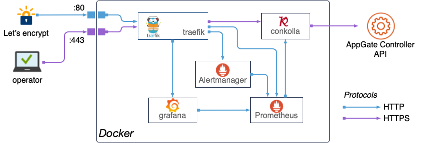

# AppGate monitoring
This is the docker compose stack for a quick setup monitoring with AppGate SDP. Instrumentation is done via the AppGate APi, and all the metrics are established through a translation of gathered information. 
The metrics are a subset of the AppGate appliance's on-board prometheus exporter (snmp-exporter). Despite the simplicity of the information, we have found that these metrics offer a good basis to build a system state view and actionable events.

>Logging, log message, request and message tracing is not part this work. 

This is currently been worked on.

## Overview

* Architecture: Docker stack deployed on docker swarm
  	* Reverse proxy as entry point and certificate resolver
  	* Grafana with prometheus & Co, time series database
  	* AppGate SDP remote prometheus exporter connecting to one or many AppGate SDP collectives





* Technology used:
	* treaefik, edge router (reverse proxy)
	* conkolla, prometheus to appgate connector and prom exporter
	* prometheus et.al, scraper, database
	* grafana, visualization and alerting front-end

## Preparations:

* Domain name `packnot.com`
* 4 DNS A records (or alias) to the hosts:
	* agtraefik.${DOMAIN}
	* agconkolla.{DOMAIN}
	* agprometheus.${DOMAIN}
	* aggrafana.{DOMAIN}

You can deploy the stack to an existing swarm. In this guide we setup a dedicated host and docker swarm. The host specs are as the following, assuming collective(s) with up to 60 appliances and using 90days retention in tsdb. 
The heavier queries prometheus/grafan will perform, the more memory and CPU you will require. For now, the following specs are proven to work fine:
* AWS: t3.standard, EC2 Amazon Linux Type 2
* Azure: Centos 7
* Disk, SSD: 40GB

Networking:
* `80/TCP in <src>` for let's encrypt
* `443/TCP in <src>` for entry-point for traefik

### Prepare EC2 Amazon linux Type 2
``` 
sudo amazon-linux-extras install docker
sudo systemctl enable docker
sudo systemctl start docker
sudo docker swarm init
```
Usermod
```
sudo usermod -a -G docker ec2-user #sudo gpasswd -a ec2-user docker
sudo setfacl -m user:ec2-user:rw /var/run/docker.sock
```
Git
```
sudo yum -y  install git
``` 

### Prepare CentOS7 (Azure)
Installing [docker community engine](https://docs.docker.com/install/linux/docker-ce/centos/#install-using-the-repository). Boils down to:

```
sudo yum remove docker \
		docker-client \
                docker-client-latest \
                docker-common \
                docker-latest \
                docker-latest-logrotate \
                docker-logrotate \
                docker-engine

sudo yum install -y yum-utils \
		device-mapper-persistent-data \
		lvm2

sudo yum-config-manager \
		--add-repo \
		https://download.docker.com/linux/centos/docker-ce.repo

sudo yum install -y docker-ce docker-ce-cli containerd.io
sudo systemctl start docker
sudo systemctl enable docker

sudo docker swarm init

```
User mod
```
export USER=<user as docker operator>
sudo usermod -a -G docker ${USER}
sudo setfacl -m user:${USER}:rw /var/run/docker.sock
```
Git
```
sudo yum -y  install git
```

SELinux changes:
```
sudo semanage port -a -t http_port_t  -p tcp 443 # websecure traefik entrypoint
sudo semanage port -a -t http_port_t  -p tcp 80  # lets encrypt traefik cert resolver
sudo setsebool httpd_can_network_connect 1 -P # allow conns (outgoing docker), add permanently
``` 

## Configure

```shell
$ git clone https://github.com/appgate/appgate-prom-monitoring.git
$ cd agmon
```

### Grafana
Adjust any settings if required in grafana/config.monitoring:
* The initial password can be replaced for user `admin`, but must match same one in `htapass/grafana_users`. You can later change and add users through the grafana UI, and you always need to add them in the `grafana_users` as well.
* Set the host name for grafana: `GF_SERVER_ROOT_URL=https://grafana.${DOMAIN}`  


### Conkolla setup
The conkolla can either connect automatically via:
1. Connection definition from file 
2. Manually through the UI on `agconkolla.${DOMAIN}`
3. By an API call/operator process

Conkolla support [AWS KMS](https://github.com/appgate/conkolla#kms-external-encryptiondecryption-provider) and can be given a base64 encoded AWS KMS blob with the additional parameters to decrytp/encrypt. You must use `auto token renewel` such conkolla always can fetch the data from the controller. Please read in the [conkolla doc](https://github.com/appgate/conkolla#prometheus-metrics) how to setup a conkolla user on the AppGate controller.

In this example we are using a connections.yml file with a plain text password for simplicity. An example will follow on a separate page to set up with an EC2 instance, IAM role and KMS. Now, the configuration file `conkolla/connections.yml` can have an example setup:
```
version: 1
connections:
- controllerURL: skip.packnot.com 
  username: monitorUser
  password: plaintext
  skipVerifySSL: true
  autoTokenRenewal: true
  promCollector: true # enable prometheus collectors
  promTargetName: skip.packnot.com # the name under which this collective can be scraped
```


### Prometheus
In prometheus/prometheus.yml, define job(s) according to the conkolla setup. Define one job as below for every target to be scraped from conkolla. The Configuration needs only 2 changes as indicated. The other settings must be kept as specified. 

```
- job_name: '<job name>' # example skip.packnot.com
     dns_sd_configs:
     - names:
       - 'tasks.conkolla'
       type: 'A'
       port: 4433

     honor_timestamps: true
     honor_labels: true
     metrics_path: /metrics
     scheme: http
     params:
       target: [<target name>] # example skip.packnot.com
     relabel_configs:
       - source_labels: [__param_target]
         target_label: target
```

* create htpasswd users: 
   * `htpasswd -c htapass/grafana_users`
   * `htpasswd -c htapass/prometheus_users`
   * `htpasswd -c htapass/conkolla_users`
   * `htpasswd -c htapass/traefik_users`

If you want to use a single htpasswd file, then create symlinks to it with the path and name as listed above.


### Alert rules and alert manager
There are just a few alerts defined in `prometheus/alert.rules`. The alerts are to notify about the system/instances/nodes and are not related to AppGate. Alerts are shown in a dedicated dashboard in grafana, deployed when provisioned. 

You can add more alerts, and in the `alertmanager/config.yml` you can specify external receivers for alerts, example using slack:
```  
route:
receiver: 'slack':
receivers:
  - name: 'slack'
    slack_configs:
      - send_resolved: true
        username: '<username>'
        channel: '#<channel-name>'
        api_url: '<incomming-webhook-url>'%
``` 

## Deploy

``` 
export DOMAIN=<domain>
export LE_EMAILADDRESS=<emaoiladdress>
``` 

``` 
HOSTNAME=$(hostname) docker stack deploy -c appgate-monitor-stack.yml agmon
``` 


